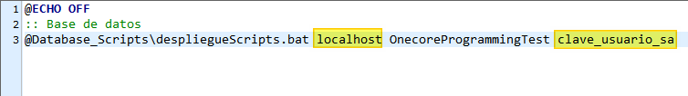
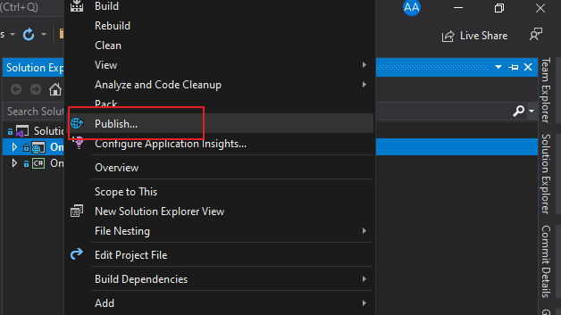
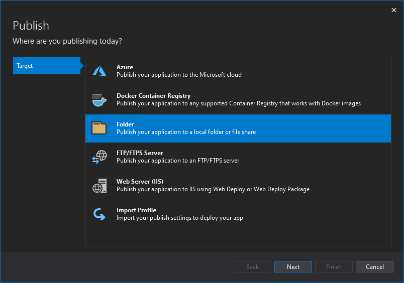
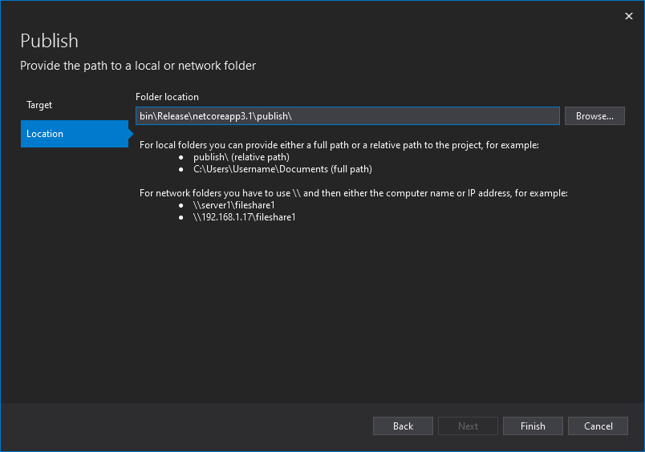
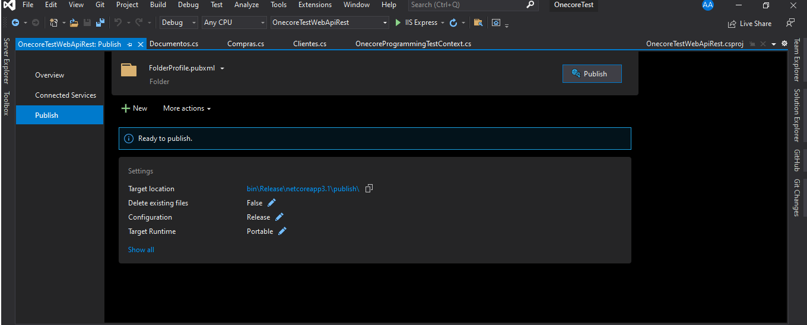
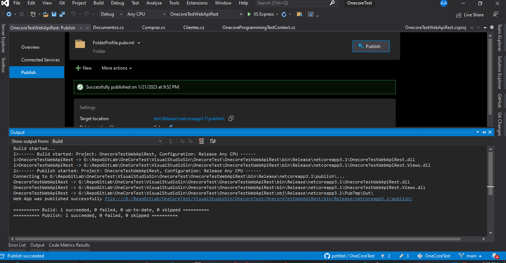
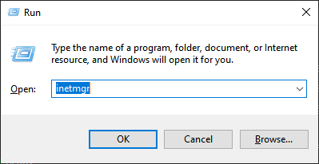
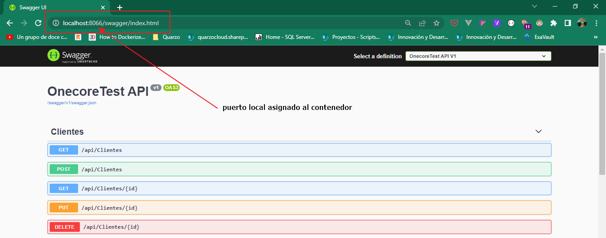
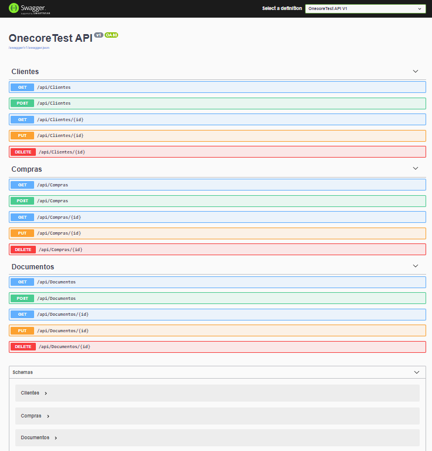

# OneCoreTest

### Prerequisitos backend/frontend

1. Debe verificar primeramente si tiene instalado la versión de framework core 3.1, mediante la ejecución del siguiente comando de .NET core CLI (Command-Line Interface):

      ```sh
      dotnet --version
      ```
    Debe obtener una salida similar a la siguiente
      ```sh
      PS C:\Users\potlitel> dotnet --version
    3.1.0
    PS C:\Users\potlitel>
      ```
    En caso de no tener instalada esta versión, puede descargarla desde el siguiente vínculo [.NET Core 3.1 SDK](https://dotnet.microsoft.com/en-us/download/dotnet/3.1).
2. Instalar node 10.15.0 desde https://nodejs.org/download/release/v10.15.0/node-v10.15.0-x64.msi
3. Instalar angular 7.3.9 de forma global con este comando:
    ```sh
      npm install -g @angular/cli@7.3.9
    ```
4. Instalar visual studio code o descargar una versión portable
5. Descompactar la carpeta **OneCoreTestFront** en una ubicación de nuestro entorno de trabajo
6. Abrir vscode

    6.1. Ejecutar Opcion File/Open Folder
    
    6.2. Entrar en la carpeta donde descompactó el proyecto
    
    6.3. Ejecutar Opcion View/Terminal
    
    6.4. Se abre la terminal..se escribe npm install y se descargan las dependencias del proyecto en la carpeta node_modules.
    
    6.1. Una vez terminada la instalación de los paquetes npm, ejecutamos el siguiente comando para que arranque el proyecto de front.
    ```sh
      ng serve
    ```
7. En el navegador teclear http://localhost:4200

### ⚙️Instalación Estandar

1. Clonar el repositorio a una ubicación local de su ordenador
   ```sh
   git clone https://github.com/potlitel/OneCoreProgrammingTest.git
   ```
2. Preparar base de datos
    
    * Verificar que se tenga previamente instalado cualquier versión Microsoft SQl Server, en caso contrario proceder a instalar algunas de sus versiones existentes.
    * Ejecutar cada uno de los scripts contenidos en la carpeta Database_Scripts (ejecutar en el mismo orden en que se encuentran enumerados los mismos). Esta carpeta cuenta con la siguiente estructura:
    
        ```bash
        ├── Database_Scripts
            ├── 01-TABLAS
            │   ├── 1-CrearDB.sql
            │   ├── 2-CrearTablaClientes.sql
            │   ├── 3-CrearTablaDocumentos.sql
            │   ├── 4-CrearTablaCompras.sql
            ├── 02-DATA_SEEDER
            │   ├── 5-DataSeed.sql
            ├── 03-Procedimientos
            │   ├── Select_Documento_byIdDocumento.sql
            │   ├── SP_SELECT_COMPRAS.SQL
            └── despliegueScripts.bat
        ```
        Puede utilizar también el utilitario **prepararBD-OneCoreProgrammingTest.bat**, en vez de ejecutar cada uno de los ficheros previamente descritos, pero en este caso, debe excluir el fichero 1-CrearDB.sql de la carpeta correspondiente y ejecutarlo antes que el fichero .bat, de este modo estaría garantizando la existencia previa de la base de datos de esta aplicación.
        Para ejecutar correctamente este utilitario de importación de scripts, debe previamente especificar los siguientes parámetros contenidos dentro del mismo fichero, para esto, clic derecho, editar con su editor de texto preferido, y ajuste los siguientes parámetros dependiendo de su entorno de trabajo local:
        <div align="center">
        
        </div>
        
3. Configurar SQL Server Reporting Services

    Debe tener configurado el servidor de reportes de MSSQL SERVER, una vez cumplido con este requisito, debe publicar el siguiente reporte (ListadoCompras.rdl) para que la aplicación pueda hacer uso del mismo. Si no está familiarizado con este proceso de configuración, puede hacer uso del vínculo siguiente : [Configuración de Reporting Services](http://therefore.net/help/2016/es-es/ins_reporting.html)

3. Publicar WebApi
    
   Para realizar una correcta publicación de la web API, debemos seguir los pasos que a continuación se listan:
   
   Clic derecho encima del proyecto webapi
   
   <div align="center">
    
    </div>
   
   y seleccionamos las opciones que seguidamente se muestran hasta completar satisfactoriamente el proceso de publicación:
   
   <div align="center">
    
    </div>
    
    <div align="center">
    
    </div>
    
    <div align="center">
    
    </div>
    
    <div align="center">
    
    </div>
    
   Copiamos entonces los ficheros obtenidos de este proceso de publicación y los pegamos en una ubicación dentro de nuestro ordenador, por ejemplo:
   
   Abrimos la ventana principal del Internet Information Services, para esto abrimos la ventana para ejecución de línea de comandos o simplemente presionamos la combinación de teclas windows + R, como se muestra:
   
   <div align="center">
    
    </div>
   

### 🐳 Instalación dockerizada 

#### Porqué Docker?

"Docker ayuda a los desarrolladores a crear y enviar aplicaciones de mayor calidad más rápido". -- [What is Docker](https://www.docker.com/what-docker#copy1)

1. Para obtener una imagen dockerizada de la Api Rest ejecute el siguiente comando, previamente posicionado sobre la carpeta contenedora de la solución de visual studio
    ```sh
       docker build -t docker_image_name -f CarpetaContenedoraProyecto/Dockerfile .
    ```
    listando un ejemplo práctico sería como se muestra seguidamente
    ```sh
       docker build -t onecore_webapidotnet -f OnecoreTestWebApiRest/Dockerfile .
    ```
    y debemos obtener una salida similar a la siguiente:
    ```sh
       [+] Building 495.0s (18/18) FINISHED
     => [internal] load build definition from Dockerfile                                                                                           0.0s
     => => transferring dockerfile: 32B                                                                                                            0.0s
     => [internal] load .dockerignore                                                                                                              0.1s
     => => transferring context: 382B                                                                                                              0.0s
     => [internal] load metadata for mcr.microsoft.com/dotnet/aspnet:3.1                                                                           0.0s
     => [internal] load metadata for mcr.microsoft.com/dotnet/sdk:3.1                                                                              0.0s
     => [internal] load build context                                                                                                              0.3s
     => => transferring context: 4.40MB                                                                                                            0.2s
     => [base 1/2] FROM mcr.microsoft.com/dotnet/aspnet:3.1                                                                                        0.0s
     => [build 1/7] FROM mcr.microsoft.com/dotnet/sdk:3.1                                                                                          0.0s
     => CACHED [build 2/7] WORKDIR /src                                                                                                            0.0s
     => CACHED [base 2/2] WORKDIR /app                                                                                                             0.0s
     => CACHED [final 1/2] WORKDIR /app                                                                                                            0.0s
     => [build 3/7] COPY [OnecoreTestWebApiRest/OnecoreTestWebApiRest.csproj, OnecoreTestWebApiRest/]                                              0.5s
     => [build 4/7] RUN dotnet restore "OnecoreTestWebApiRest/OnecoreTestWebApiRest.csproj"                                                      475.3s
     => [build 5/7] COPY . .                                                                                                                       0.2s
     => [build 6/7] WORKDIR /src/OnecoreTestWebApiRest                                                                                             0.1s
     => [build 7/7] RUN dotnet build "OnecoreTestWebApiRest.csproj" -c Release -o /app/build                                                      11.7s
     => [publish 1/1] RUN dotnet publish "OnecoreTestWebApiRest.csproj" -c Release -o /app/publish                                                 5.3s
     => [final 2/2] COPY --from=publish /app/publish .                                                                                             0.3s
     => exporting to image                                                                                                                         0.5s
     => => exporting layers                                                                                                                        0.5s
     => => writing image sha256:b526db2b706abee3bbc870a48f753c82b9fb1807c3f016d2b1ae464f51c864b1                                                   0.0s
     => => naming to docker.io/library/onecore_webapidotnet                                                                                        0.0s

    Use 'docker scan' to run Snyk tests against images to find vulnerabilities and learn how to fix them
    ```
 2. ejecutamos el siguiente comando docker para comprobar la existencia de la nueva imagen recientemente creada
    ```sh
       docker images
    ```
    y debemos obtener una salida similar a la siguiente:
    ```sh
       REPOSITORY                        TAG                 IMAGE ID       CREATED          SIZE
       onecore_webapidotnet              latest              b526db2b706a   28 minutes ago   244MB
    ```
    ejecutamos entonces el siguiente comando para instanciar la aplicación recientemente dockerizada
    ```sh
       docker run -d -p puerto_host:80 --name nombre_contenedor imagen_docker_webApi
    ```
    ejemplo práctico sería:
    ```sh
       PS C:\Users\potlitel> docker run -d -p 8066:80 --name onecore_webapidotnetcontainer onecore_webapidotnet
       0308903c7fc7180259abf5d81bf2b6f962d574e1bdfacce9d77e1564084b7009
    ```
    si inspeccionamos el fichero log que retorna el comando ejecutado previamente, podemos verificar que nuestro contenedor está ejecutandose de modo satisfactorio, para esto, ejecutamos lo siguiente:
    ```sh
       PS C:\Users\potlitel> docker logs -f 0308903c7fc7
        warn: Microsoft.AspNetCore.DataProtection.Repositories.FileSystemXmlRepository[60]
              Storing keys in a directory '/root/.aspnet/DataProtection-Keys' that may not be persisted outside of the container. Protected data will be unavailable when container is destroyed.
        warn: Microsoft.AspNetCore.DataProtection.KeyManagement.XmlKeyManager[35]
              No XML encryptor configured. Key {eb86deea-08f9-4745-9db1-b3839622f6af} may be persisted to storage in unencrypted form.
        info: Microsoft.Hosting.Lifetime[0]
              Now listening on: http://[::]:80
        info: Microsoft.Hosting.Lifetime[0]
              Application started. Press Ctrl+C to shut down.
        info: Microsoft.Hosting.Lifetime[0]
              Hosting environment: Production
        info: Microsoft.Hosting.Lifetime[0]
              Content root path: /app
    ```
    Abrimos el navegador de nuestra preferencia y ponemos la dirección con el puerto que especificamos en el comando para instanciar nuestra webapi, y... debemos obtener algo similar a la imagen que seguidamente se muestra:
    <div align="center">
    
    </div>
#### Utilizando docker-compose

El empleo del comando docker-compose nos facilita instanciar aplicaciones multi-contenedores, para esto, ejecutamos este comando utilizando el fichero docker-compose.yml ubicado en la carpeta docker_compose con la siguiente sentencia:
```sh
    cd docker_compose
    docker-compose up -d
```
y debemos obtener una salida similar a la siguiente:
```sh
    PS C:\Users\potlitel\Documents\docker_compose> docker-compose up -d
    Creating network "docker_compose_networkapp" with the default driver
    Creating network "docker_compose_default" with the default driver
    Creating miwebapi_dotnetcore ... done
    Creating portainer-ce        ... done
```
Abrimos nuevamente el navegador de nuestra preferencia y ponemos la dirección con el puerto que especificamos en el fichero docker-compose.yml para instanciar nuestra webapi, y... debemos obtener algo similar a la imagen que seguidamente se muestra:
    <div align="center">
    
    </div>
Dentro del fichero docker-compose.yml se incluyó el uso de portainer como administrador visual para la gestión de todos los contenedores dockers, para más información visite el siguiente link: [Portainer](https://www.portainer.io/)
### Swagger

#### Porqué Swagger?

“Una API pierde su sentido sino es accesible y si no tenemos una documentación que nos ayude a entenderla.” -- [SWAGGER Y SWAGGER UI](https://www.chakray.com/es/swagger-y-swagger-ui-por-que-es-imprescindible-para-tus-apis/#:~:text=Cuando%20hablamos%20de%20Swagger%20nos,que%20todo%20el%20mundo%20entienda)

Una vez tenemos desplegada nuestra api rest, podemos acceder a la interfaz de Swagger mediante la siguiente url http://host:puerto/swagger/index.html y debemos obtener una interfaz similar a la siguiente:

<div align="center">
  
</div>

Para más información, visite [Hosted, Interactive API Documentation](https://swagger.io/tools/swaggerhub/hosted-api-documentation/)
### 📚 Documentación útil

- [How to Build CRUD REST APIs with ASP.NET Core 3.1 and Entity Framework Core, Create JWT Tokens, and Secure APIs](https://www.syncfusion.com/blogs/post/how-to-build-crud-rest-apis-with-asp-net-core-3-1-and-entity-framework-core-create-jwt-tokens-and-secure-apis.aspx#create-an-ASP-NET-Core-REST-API-application)
- [Configuring and Using Swagger UI in ASP.NET Core Web API](https://code-maze.com/swagger-ui-asp-net-core-web-api/)
- [Web API in NET 6 + Docker](https://dev.to/berviantoleo/web-api-in-net-6-docker-41d5)
- [Run And Test ASP.NET Core Web API Docker Container Locally
](https://www.c-sharpcorner.com/article/run-and-test-asp-net-core-web-api-docker-container-locally/)
- [Soft Deleting in Entity Framework Core](https://spin.atomicobject.com/2019/01/29/entity-framework-core-soft-delete/) 
- [Soft delete with EF Core](https://medium.com/@uslperera/soft-delete-with-ef-core-c677bff73ef7) 
- [EF Core In depth – Soft deleting data with Global Query Filters](https://www.thereformedprogrammer.net/ef-core-in-depth-soft-deleting-data-with-global-query-filters/) 
- [Failed to compute cache key: ".csproj" not found](https://stackoverflow.com/questions/66933949/failed-to-compute-cache-key-csproj-not-found) 
- [API Request and Response Logging Middleware using .NET 5 (C#)](https://alexbierhaus.medium.com/api-request-and-response-logging-middleware-using-net-5-c-a0af639920da) 
- [Logging HTTP Request and Response in .NET Web API](https://medium.com/@luisalexandre.rodrigues/logging-http-request-and-response-in-net-web-api-268135dcb27b) 
- [How to Deploy ASP.NET Core to IIS & How ASP.NET Core Hosting Works](https://stackify.com/how-to-deploy-asp-net-core-to-iis/) 
- [Hosting ASP.NET Web API REST Service On IIS 10](https://www.c-sharpcorner.com/article/hosting-asp-net-web-api-rest-service-on-iis-10/) 
- [Deploy ASP.NET Core Web API on IIS](https://codingsonata.medium.com/deploy-asp-net-core-web-api-on-iis-f75e755a6402) 
- [ASP.NET Core return JSON with status code](https://stackoverflow.com/questions/42360139/asp-net-core-return-json-with-status-code) 
- [How to Implement Pagination in ASP.NET Core WebAPI? – Ultimate Guide](https://codewithmukesh.com/blog/pagination-in-aspnet-core-webapi/) 
- [CREACIÓN DE REPORTES CON MICROSOFT SQL REPORT BUILDER](https://docs.oasiscom.com/Desarrollo/reporterdl) 
- [ASP.NET Core in a container](https://code.visualstudio.com/docs/containers/quickstart-aspnet-core) 
- [Create ASP.NET Web API service](https://help.boldreports.com/embedded-reporting/javascript-reporting/report-viewer/report-service/create-aspnet-web-api-service/#create-aspnet-web-api-service) 


